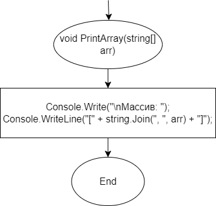
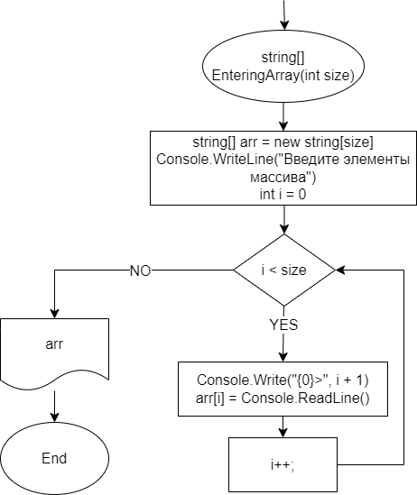
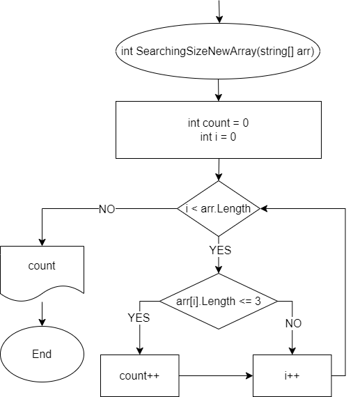
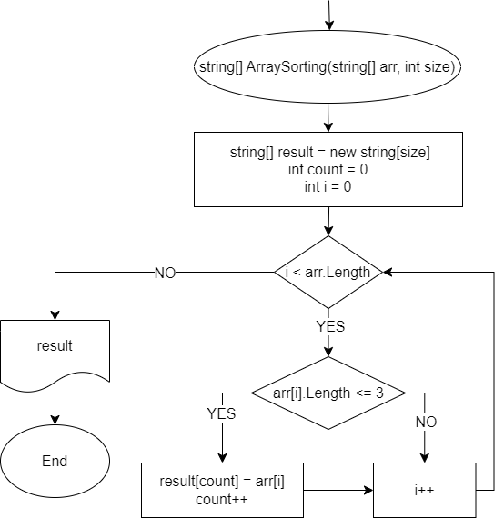

# **Итоговая контрольная работа по основному блоку.**   
**Задача:** Написать программу, которая из имеющегося массива строк формирует новый массив из строк, длина которых меньше, либо равна 3 символам. Первоначальный массив можно ввести с клавиатуры, либо задать на старте выполнения алгоритма. При решении не рекомендуется пользоваться коллекциями, лучше обойтись исключительно массивами.

*Примеры:*   
[“Hello”, “2”, “world”, “:-)”] → [“2”, “:-)”]   
[“1234”, “1567”, “-2”, “computer science”] → [“-2”]   
[“Russia”, “Denmark”, “Kazan”] → []   

## _**Алгоритм решения задачи:**_   
1. *Ввод массива:*
    * Запрашиваем у пользователя размер массива;
    * Создаем массив строк userArray и заполняем его значениями, введенными пользователем.
2. *Вывод исходного массива:*
    * Используя метод PrintArray, выводим исходный массив.
3. *Поиск размера нового массива:*
    * Используем метод SearchingSizeNewArray для определения количества элементов, удовлетворяющих условию (длина строки не больше 3 символов).
4. *Создание нового массива:*
    * Создаем массив строк result размером, определенным в предыдущем шаге;
    * Используем цикл для добавления в result строк, удовлетворяющих условию.
5. *Вывод нового массива:*
    * Используем метод PrintArray, но для вывода нового массива.   

## _**Блок-схемы методов, используемых в решении задачи:**_   
### 1. Метод **PrintArray**   
   
### 2. Метод **EnteringArray**   
   
### 3. Метод **SearchingSizeNewArray**   
   
### 4. Метод **ArraySorting**   

